  

  

  
  
  
  
  

<table width="100%">
  <tr>
    <td width="58%" valign="top">
      <h3><code>root@github:~$ ./profile --scan</code></h3>
<pre>
&gt; user      : GuilhermeGms3
&gt; alias     : GuilhermeGms3
&gt; role      : Software Engineering Student | DevSecOps
&gt; focus     : Backend | Frontend | Data Analysis | Automation
&gt; status    : SYSTEM ONLINE | FIREWALL ACTIVE
&gt; mindset   : Smart problem-solving, automation and data security

root@github:~$ &#9608;
</pre>
    </td>
    <td width="42%" valign="top">
      <h3><code>about.me</code></h3>
<pre>
Software Engineering student focused on
automation, backend systems, security
fundamentals and useful interfaces.

current_mode : learn -&gt; build -&gt; refine
mission      : turn ideas into reliable tools
approach     : clarity, logic, consistency
</pre>
    </td>
  </tr>
</table>

## Tech Stack

<table>
  <tr>
    <td align="center" width="96">
        
       C#
    </td>
    <td align="center" width="96">
      
       Python
    </td>
    <td align="center" width="96">
        
       Javascript
    </td>
    <td align="center" width="96">
        
       C++
    </td>
       <td align="center" width="96">
        
       Django
    </td>
       <td align="center" width="96">
        
       Github
    </td>
          <td align="center" width="96">
        
       Rest API
    </td>
          <td align="center" width="96">
        
       Docker
    </td>
    <td align="center" width="96">
        
       Nginx
    </td>
  </tr>
  <tr>
    <td align="center" width="96">
        
       Git
    </td>
    <td align="center"  width="96">
        
       GitLab
    </td>
    <td align="center"  width="96">
        
       HTML
    </td>
    <td align="center" width="96">
        
       CSS
    </td>
    <td align="center"  width="96">
        
       Bootstrap
    </td>
    <td align="center" width="96">
        
       Tailwind
    </td>
        <td align="center" width="96">
        
       JQuery
    </td>
        <td align="center" width="96">
        
       PostgreSQL
    </td>
            <td align="center" width="96">
        
       ASP.NET
    </td>
  </tr>
   <tr>
    <td align="center" width="96">
        
       Redis
    </td>
        <td align="center" width="96">
        
       Postman
    </td>
            <td align="center" width="96">
        
       Linux
    </td>
    <td align="center" width="96">
        
       Dart
    </td>
    <td align="center" width="96">
        
       RabbitMQ
    </td>
    <td align="center" width="96">
        
       sentry
    </td>
    <td align="center" width="96">
        
       Celery
    </td>
    <td align="center" width="96">
        
       Docusaurus
    </td>
    <td align="center" width="96">
        
       Pytest
    </td>
  </tr>
 <tr>
 </tr>
</table>

## GitHub Metrics

  
  

  

## Extra Pins

### ⚡ Engineered Solutions

<table>
  <tr>
    <td width="50%" valign="top">
      <h3>🛰️ <a href="https://github.com/GuilhermeGms3/soc-automation-lab">SOC Automation Lab</a></h3>
      

        
        
        
      

      <blockquote>Practical SOC lab with detection rules, alert forwarding and incident response playbook.</blockquote>
    </td>
    <td width="50%" valign="top">
      <h3>⚡ <a href="https://github.com/GuilhermeGms3/ticket-api">Ticket API</a></h3>
      

        
        
        
      

      <blockquote>Backend API with auth, ticket lifecycle, and production-oriented service structure.</blockquote>
    </td>
  </tr>
  <tr>
    <td width="50%" valign="top">
      <h3>🛡️ <a href="https://github.com/GuilhermeGms3/firewall-automation">Firewall Automation</a></h3>
      

        
        
        
      

      <blockquote>Automation-first hardening workflow for secure baseline and faster operations.</blockquote>
    </td>
    <td width="50%" valign="top">
      <h3>👁️ <a href="https://github.com/GuilhermeGms3/Crud-em-java">CRUD em Java</a></h3>
      

        
        
        
      

      <blockquote>Integrated full-stack application focused on practical software engineering fundamentals.</blockquote>
    </td>
  </tr>
</table>

---

<i>"Good code solves problems. Great code also stays maintainable."</i>

  

  

