  

  

  
  
  
  

<table width="100%">
  <tr>
    <td width="58%" valign="top">
      <h3><code>root@github:~$ ./profile --scan</code></h3>
<pre>
&gt; user      : GuilhermeGms3
&gt; role      : Software Engineering Student
&gt; track     : NOC | DevOps | Backend
&gt; focus     : Observability | Cloud | Automation
&gt; status    : SYSTEM ONLINE | BUILDING
&gt; mindset   : Solve clearly. Automate responsibly.

root@github:~$ &#9608;
</pre>
    </td>
    <td width="42%" valign="top">
      <h3><code>about.me</code></h3>
<pre>
I build practical systems for monitoring,
automation and reliable operations.

current_mode : learn -&gt; build -&gt; measure
mission      : reduce toil with useful tools
approach     : clarity, security, consistency
</pre>
    </td>
  </tr>
</table>

## Current Focus

| SIGNAL | WHAT I AM BUILDING |
|:--|:--|
| `OBSERVABILITY` | SNMP telemetry, Prometheus metrics, Grafana dashboards and actionable alerts |
| `DELIVERY` | Reproducible CI/CD with GitHub Actions, Terraform, containers and AWS |
| `OPERATIONS` | NOC incident flows, health checks, runbooks and notification automation |

## Tech Stack

<table>
  <tr>
    <td align="center" width="96">
        
       C#
    </td>
    <td align="center" width="96">
      
       Python
    </td>
    <td align="center" width="96">
        
       Javascript
    </td>
    <td align="center" width="96">
        
       C++
    </td>
       <td align="center" width="96">
        
       Django
    </td>
       <td align="center" width="96">
        
       Github
    </td>
          <td align="center" width="96">
        
       Rest API
    </td>
          <td align="center" width="96">
        
       Docker
    </td>
    <td align="center" width="96">
        
       Nginx
    </td>
  </tr>
  <tr>
    <td align="center" width="96">
        
       Git
    </td>
    <td align="center"  width="96">
        
       GitLab
    </td>
    <td align="center"  width="96">
        
       HTML
    </td>
    <td align="center" width="96">
        
       CSS
    </td>
    <td align="center"  width="96">
        
       Bootstrap
    </td>
    <td align="center" width="96">
        
       Tailwind
    </td>
        <td align="center" width="96">
        
       JQuery
    </td>
        <td align="center" width="96">
        
       PostgreSQL
    </td>
            <td align="center" width="96">
        
       ASP.NET
    </td>
  </tr>
   <tr>
    <td align="center" width="96">
        
       Redis
    </td>
        <td align="center" width="96">
        
       Postman
    </td>
            <td align="center" width="96">
        
       Linux
    </td>
    <td align="center" width="96">
        
       Dart
    </td>
    <td align="center" width="96">
        
       RabbitMQ
    </td>
    <td align="center" width="96">
        
       sentry
    </td>
    <td align="center" width="96">
        
       Celery
    </td>
    <td align="center" width="96">
        
       Docusaurus
    </td>
    <td align="center" width="96">
        
       Pytest
    </td>
  </tr>
 <tr>
 </tr>
</table>

## Frameworks & Libraries

<table width="100%">
  <tr>
    <td width="22%"><strong>Backend</strong></td>
    <td>
      
      
      
      
    </td>
  </tr>
  <tr>
    <td width="22%"><strong>Interfaces</strong></td>
    <td>
      
      
    </td>
  </tr>
  <tr>
    <td width="22%"><strong>Data & Automation</strong></td>
    <td>
      
      
    </td>
  </tr>
</table>

## Engineering Showcase

<table>
  <tr>
    <td width="50%" valign="top">
      <h3><a href="https://github.com/GuilhermeGms3/muse-studio">Muse Studio</a></h3>
      

        
        
        
      

      <blockquote>Adaptive learning path for guitar, acoustic guitar, keyboard and bass, with structured practice and progress tracking.</blockquote>
    </td>
    <td width="50%" valign="top">
      <h3><a href="https://github.com/GuilhermeGms3/psyos-aura">PsyOS Aura</a></h3>
      

        
        
        
      

      <blockquote>Copilot for psychologists with an emotional-inference engine, session workspace and decision-support dashboards.</blockquote>
    </td>
  </tr>
  <tr>
    <td width="50%" valign="top">
      <h3><a href="https://github.com/GuilhermeGms3/hub-jornada-infrasec">Hub Jornada InfraSec</a></h3>
      

        
        
        
        
      

      <blockquote>Guided certification journey with content, adaptive exams, practical labs and portfolio evidence for InfraSec careers.</blockquote>
    </td>
    <td width="50%" valign="top">
      <h3><a href="https://github.com/GuilhermeGms3/aws-cicd-blueprint">AWS CI/CD Blueprint</a></h3>
      

        
        
        
      

      <blockquote>Security-gated pipeline for testing, container publishing and automated deployment to AWS ECS Fargate.</blockquote>
    </td>
  </tr>
  <tr>
    <td width="50%" valign="top">
      <h3><a href="https://github.com/GuilhermeGms3/noc-incident-sentinel">NOC Incident Sentinel</a></h3>
      

        
        
        
      

      <blockquote>HTTP, TCP and DNS checks with alert routing, operational status endpoint, dashboard and incident runbook.</blockquote>
    </td>
    <td width="50%" valign="top">
      <h3><a href="https://github.com/GuilhermeGms3/network-monitor">Network Monitor</a></h3>
      

        
        
        
      

      <blockquote>SNMP telemetry for CPU, uptime and interface traffic, with Prometheus metrics and baseline availability alerts.</blockquote>
    </td>
  </tr>
</table>

## GitHub Activity

  

## Contribution Flow

  <picture>
    <source media="(prefers-color-scheme: dark)" srcset="https://raw.githubusercontent.com/GuilhermeGms3/GuilhermeGms3/output/github-contribution-grid-snake-dark.svg" />
    <source media="(prefers-color-scheme: light)" srcset="https://raw.githubusercontent.com/GuilhermeGms3/GuilhermeGms3/output/github-contribution-grid-snake.svg" />
    
  </picture>

<i>"Useful software is built, observed and continuously improved."</i>

  

