

  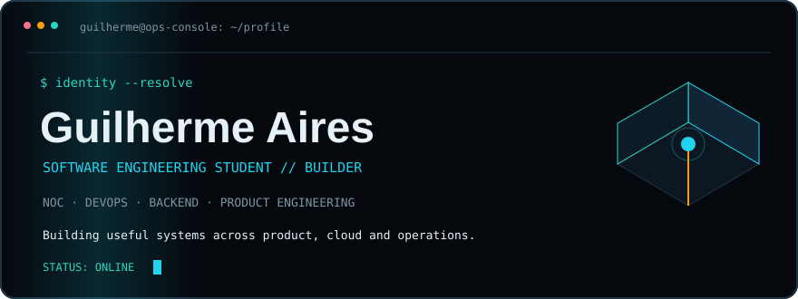
  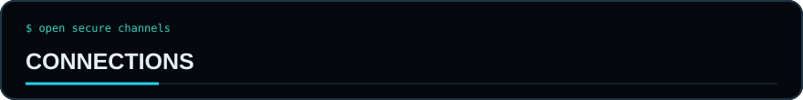
  <a href="https://www.linkedin.com/in/guilhermegms3/">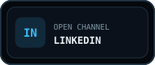</a><a href="https://terminal-core-six.vercel.app">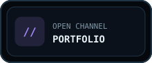</a><a href="https://gitlab.com/GuilhermeGms3">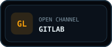</a><a href="https://github.com/GuilhermeGms3">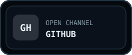</a>
  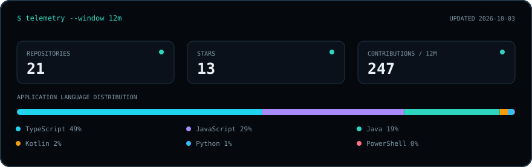
  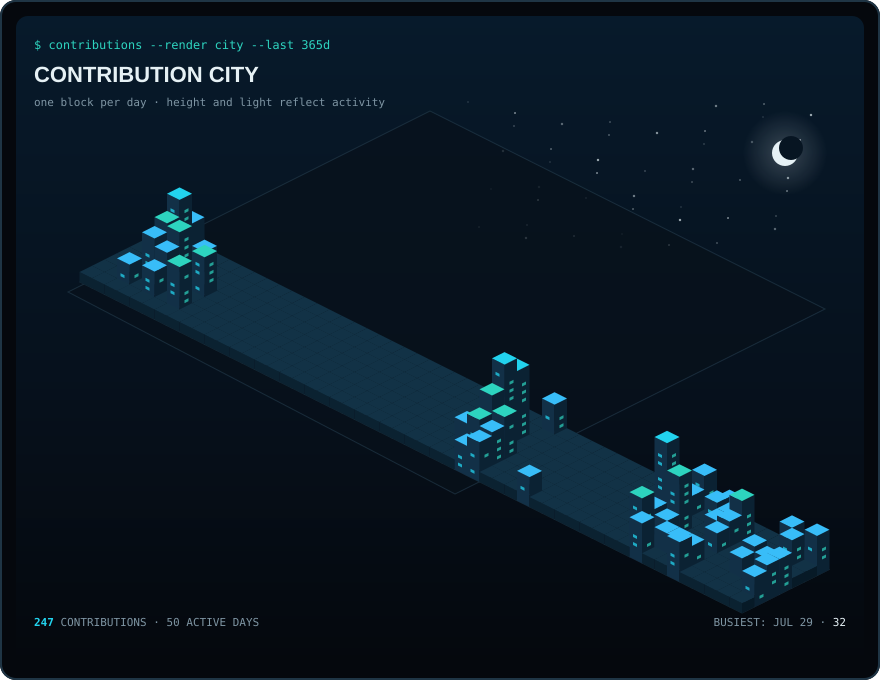
  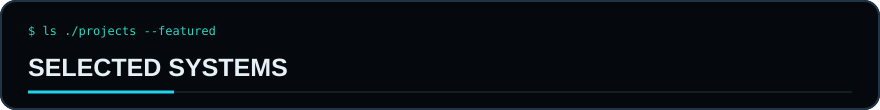
  <a href="https://github.com/GuilhermeGms3/muse-studio">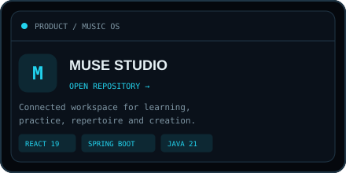</a><a href="https://github.com/GuilhermeGms3/scriptorium-os">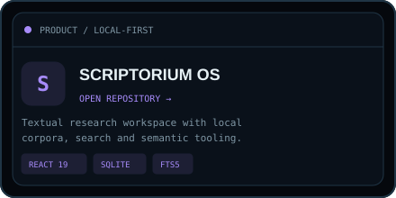</a>
  <a href="https://github.com/GuilhermeGms3/hub-jornada-infrasec">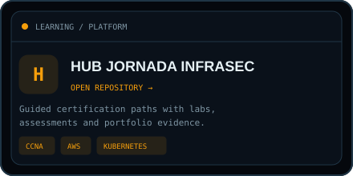</a><a href="https://github.com/GuilhermeGms3/aws-cicd-blueprint">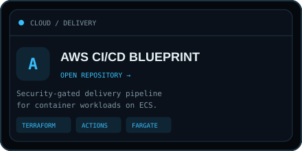</a>
  <a href="https://github.com/GuilhermeGms3/noc-incident-sentinel">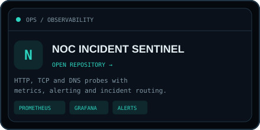</a><a href="https://github.com/GuilhermeGms3/network-monitor">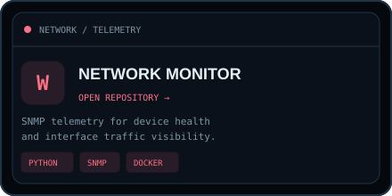</a>
  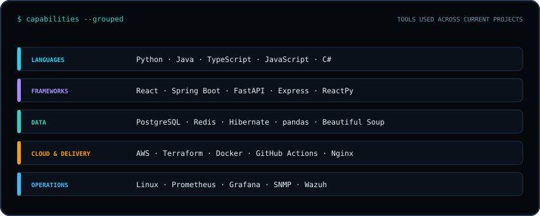
  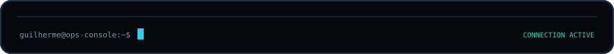

